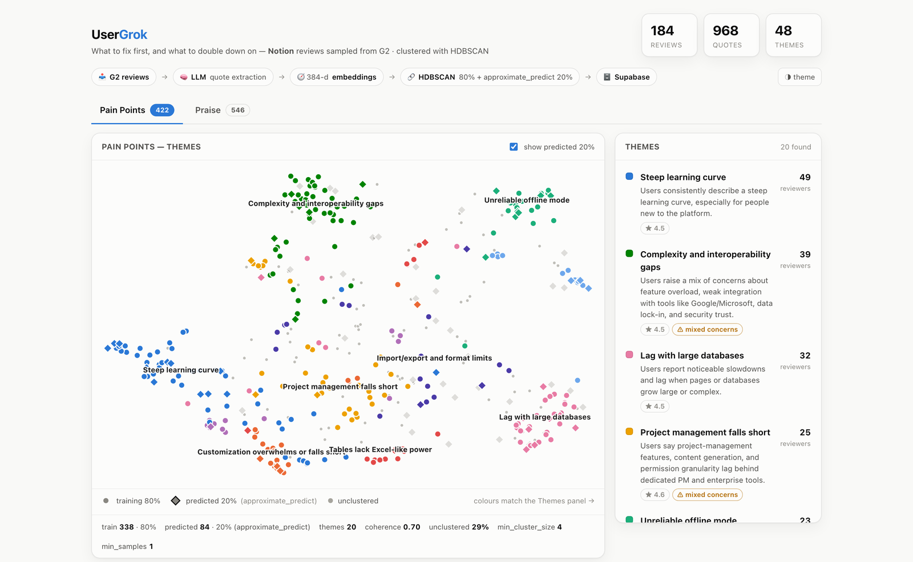

# UserGrok — feedback-analysis technical demo

A small end-to-end prototype that turns raw product reviews into two answers a product
team can act on: **what to fix first**, and **what users love that's worth doubling down
on**. It is a technical demo, not a production app.

**Pipeline:** G2 reviews → LLM quote extraction → high-dimensional embeddings →
per-category HDBSCAN clustering on those vectors directly (80% fit + 20%
`approximate_predict`) → stored in Supabase → visualized in a small FastAPI +
vanilla-JS web app.

Feedback is split into just two categories, **pain points** and **praise**. An earlier
version separated "feature request" from "bug report", but that distinction is unstable
for review text — *"offline mode is basically nonexistent"* was filed as a feature
request while *"the offline mode still isn't great"* became a bug report (cosine 0.85),
splitting one theme across two views. What a team acts on is the concern, not whether the
user phrased it as a defect or a wish.

Sample product: **Notion**. Sample source: **G2** reviews.

[](https://bjornd.github.io/usergrok/)

*Pain-point themes from 184 G2 reviews. Circles are the 80% HDBSCAN was fit on, diamonds
the held-out 20% placed by `approximate_predict`, grey dots the quotes left unclustered.
Themes are ranked by how many distinct reviewers raised them.*
**[Try the live demo →](https://bjornd.github.io/usergrok/)**

---

## What it does

1. **Collect** (`pipeline/00_collect_g2.py`) — pulls ~180 Notion reviews from public
   G2 pages via the Wayback Machine (the live site rate-limits scraping), parses the
   `like` / `dislike` / `problems` sections, dedups by G2's stable review id.
2. **Extract** (`02_extract_quotes.py`) — an LLM reads each review and pulls short
   **verbatim quotes**, each tagged `pain_point` or `praise`, one concern per quote.
3. **Embed** (`03_embed.py`) — each quote → a 384-d vector (`all-MiniLM-L6-v2`),
   stored in a `pgvector` column.
4. **Cluster** (`04_cluster.py`) — the core step. Per category: an 80/20 split;
   `hdbscan.HDBSCAN(prediction_data=True)` is fit on the 80% of **raw 384-d vectors**
   and **saved to disk**; the held-out 20% is assigned with `hdbscan.approximate_predict`
   against the reloaded model. UMAP gives 2-D coordinates for the plot (viz only).
5. **Label** (`05_label_clusters.py`) — the LLM names each cluster (label + summary).
6. **Visualize** (`app/`) — per-category scatter of quotes, colored by cluster, with the
   20% predicted points drawn as ring-outlined diamonds; a themes panel ranked by distinct
   reviewers; hover + click for the quote and its source review.

The LLM backend is the local, authenticated **`claude` CLI** (Claude Code) — no API
key required (`pipeline/common.py` → `claude()`).

---

## Prerequisites

- Python 3.12, Docker running, and the [Supabase CLI](https://supabase.com/docs/guides/cli)
  (`brew install supabase/tap/supabase`).
- The `claude` CLI, signed in (used as the LLM backend).

## Setup & run

```bash
# 1. Python env
python3 -m venv .venv && ./.venv/bin/pip install -r requirements.txt

# 2. Local Supabase (uses shifted ports 5442x so it coexists with any other stack)
supabase start                 # applies supabase/migrations/0001_init.sql
cp .env.example .env           # values already match the shifted ports

# 3. Run the pipeline (00 is optional — data/raw_reviews.json is committed)
./.venv/bin/python pipeline/00_collect_g2.py     # optional: re-scrape from Wayback
./.venv/bin/python pipeline/01_ingest_reviews.py
./.venv/bin/python pipeline/02_extract_quotes.py # LLM; the slow step
./.venv/bin/python pipeline/03_embed.py
./.venv/bin/python pipeline/04_cluster.py        # replaces the previous run per category
./.venv/bin/python pipeline/05_label_clusters.py # always re-run after 04 (new run = no labels yet)

# 4. Web app
./.venv/bin/python app/run.py
# open http://127.0.0.1:8317   (set PORT to use a different one)
```

Browse the raw tables in Supabase Studio at the URL from `supabase status`
(`http://127.0.0.1:54423` with the default shifted ports).

Every pipeline step is **idempotent** — rerunning skips already-processed rows, so
you can stop and resume.

---

## Sharing a static demo (no backend, no database)

**Live demo: https://bjornd.github.io/usergrok/**

`static_site/` is a self-contained build of the app that reads plain JSON instead of the
API — the whole thing is ~420 KB, so it can be zipped, committed, or dropped on any static
host (GitHub Pages, S3, Netlify).

```bash
./.venv/bin/python pipeline/06_export_static.py   # regenerate after a pipeline run
python3 -m http.server -d static_site 8000        # then open http://127.0.0.1:8000
```

```
static_site/
├── index.html            # the same page, pointed at the JSON files
└── data/
    ├── summary.json      # counts + per-category run metadata
    ├── pain_point.json   # clusters + every quote with its coords and assignment
    └── praise.json
```

It is published by `.github/workflows/pages.yml` on every push to `main` (the repo's
Pages source is set to *GitHub Actions*).

The export calls the same functions the API serves rather than re-implementing their
queries, so the static build can't silently drift from the live one. The page picks its
data source from `window.USERGROK_SOURCES`, which the export predefines — one `index.html`
serves both modes, with no build step and no duplicated frontend.

**It must be served over http://, not opened as a `file://` path** — browsers block
`fetch` on file URLs, so the page would load but stay empty.

---

## Data model (Supabase / Postgres)

| table | what it holds |
|---|---|
| `reviews` | one row per collected G2 review (like/dislike/problems text, rating, provenance) |
| `quotes` | LLM-extracted quotes, category, and 384-d `embedding` (pgvector) |
| `cluster_runs` | one run per category — HDBSCAN params + metrics + saved model path |
| `clusters` | per-cluster label, summary, size, `mixed` flag (`cluster_id = -1` is noise) |
| `quote_clusters` | each quote's cluster, `split` (`train`/`test`), `assigned_by`, probability, and 2-D x/y |

The saved HDBSCAN models live in `models/<category>.joblib`
(`{clusterer, train_quote_ids, params}`).

### How a quote gets its cluster (`assigned_by`)

| value | meaning |
|---|---|
| `hdbscan` | density-clustered as part of the 80% training split |
| `approximate_predict` | held-out 20%, mapped onto the saved model |
| `unclustered` | too far from every cluster (`cluster_id = -1`) |

The UI encodes all three, so nothing is silently presented as a density-clustered member.

### Clustering runs on the raw embeddings

HDBSCAN and `approximate_predict` both operate on the full 384-d vectors, with no
reduction step in between: the distances that form the themes are distances between the
embeddings themselves.

That choice has a measured cost, and it is worth being plain about it. Density estimation
gets harder as dimensionality rises, so many more quotes stay unclustered than when the
vectors were first projected down — but the themes that do form are tighter:

| | on raw 384-d (current) | with a PCA step (previous) |
|---|---|---|
| pain points | 32 themes, coherence **0.84**, largest 8%, 63% unclustered | 20 themes, coherence 0.70, largest 17%, 29% unclustered |
| praise | 31 themes, coherence **0.85**, largest 7%, 73% unclustered | 28 themes, coherence 0.73, largest 15%, 38% unclustered |

Both categories now behave the same way: many small, specific themes with no cluster
dominating, at the price of leaving most quotes unclustered.

#### `cluster_selection_method` matters more than any parameter here

HDBSCAN's default `'eom'` (excess of mass) prefers large, stable clusters. On a
semantically homogeneous category that is fatal: praise collapsed to **3 themes, one
holding 97% of its quotes**, and no `min_cluster_size` / `min_samples` /
`cluster_selection_epsilon` combination avoided it. Switching to `'leaf'` — take the
leaves of the condensed tree instead of the most persistent nodes — produced 31 themes
with the largest at 7%.

Both methods are in the sweep and the constraints choose, but on this data both
categories select `'leaf'`.

A second fix was needed alongside it: generalization (the share of an unseen split that
`approximate_predict` still assigns) used to be a hard global floor. Every well-shaped
praise model sits at 15-19%, so the floor rejected all of them and left the blob as the
only survivor. It is now one of the tiered constraints, relaxing in step with the others.

### Selection optimizes coherence, not coverage

Model selection is a **constrained search**, not a weighted score (blending several
desiderata into one number meant every re-weighting fixed one category and broke
another). A candidate must produce a readable number of themes, with no single cluster
swallowing the category, and must still accept unseen quotes — generalization is measured
with `approximate_predict` on an **inner validation split carved out of the 80%**, so the
real 20% is never consulted during model selection.

Among the candidates that clear those bars, the winner is the one with the highest
**coherence**: mean cosine similarity of each quote to its own cluster centroid, measured
in the original embedding space. Coherence is the objective because a theme is only
actionable if its quotes are really about one thing — optimizing coverage instead produced
broad clusters that fused two concerns (an "AI reliability" cluster quietly absorbing
PDF-export and page-load complaints), which is worse than leaving a few quotes out.

Two guards keep coherence from running away with it:

- a **coverage floor**, so it can't keep a handful of ultra-tight clusters and leave most
  feedback invisible. It relaxes through tiers; on raw 384-d few candidates reach the top
  tier, so the lower ones usually decide, but the ladder still prefers a well-spread
  clustering wherever one exists.
- a **theme ceiling that scales with the category** (`n/18`), because a 546-quote category
  can support ~30 distinct themes while a 100-quote one cannot. A flat cap silently
  collapsed the largest category into a handful of coarse buckets.

The labeling step then asks the LLM to flag any cluster that still covers more than one
concern. Those are stored (`clusters.mixed`) and shown in the UI as a **⚠ mixed concerns**
badge rather than quietly repaired. Density clustering still yields the occasional
grab-bag of unrelated one-off bugs ("PDF import fails" beside "cursor invisible in light
mode"), and a weak theme the reader can discount is much safer than one that looks solid.
On the current data ~40% of pain-point themes and ~18% of praise themes carry the badge —
that is the honest state of the clustering, not a number to hide.

---

## Demo caveats (it's a prototype)

- **LLM backend is the `claude` CLI**, so extraction cost/latency depends on your
  Claude Code plan rather than a metered API key.
- **The 2-D coordinates are for visualization only** (UMAP) — HDBSCAN clusters in the
  full 384-d space, not in the projection, so points can look adjacent without sharing a
  cluster.
- **Unclustered quotes are expected and are not a defect.** Some feedback really is a
  one-off. An earlier version attached these to their nearest theme to drive the count
  down; that made the themes mean less, so it was removed. A quote HDBSCAN rejects stays
  in `Unclustered`.
- **Themes are ranked by distinct reviewers, not quote count**, so one effusive reviewer
  contributing four quotes doesn't outrank four people hitting the same wall. The average
  review rating shown per theme is a rough severity read, not a model output.
- Reviews skew positive (Notion is well-rated on G2), so `pain_point` quotes mostly come
  from the "What do you dislike" sections and praise outnumbers them roughly 3:2.
